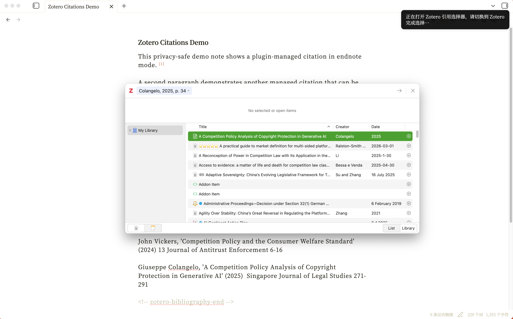
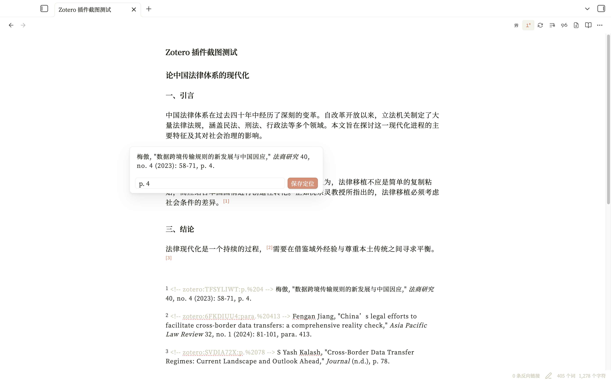
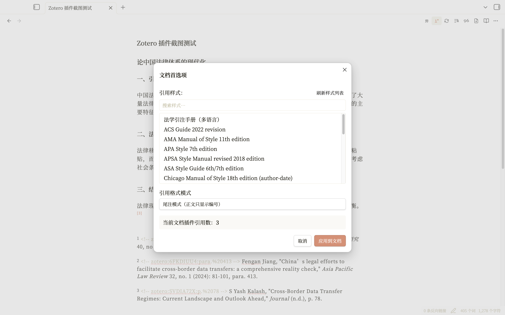
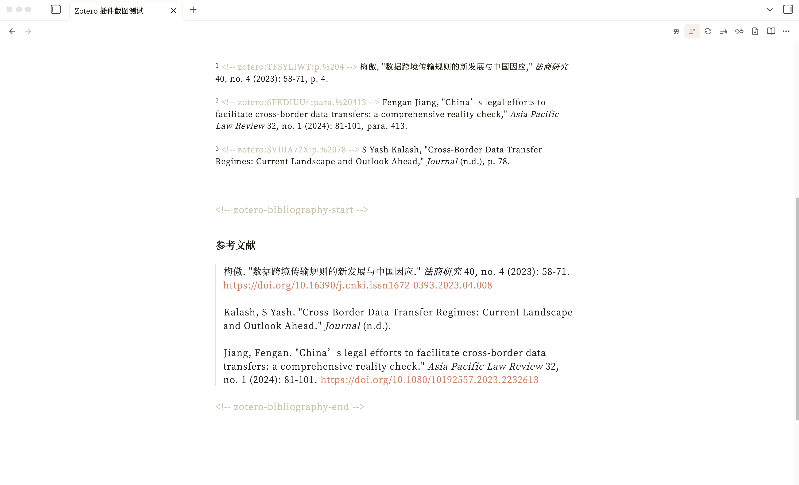
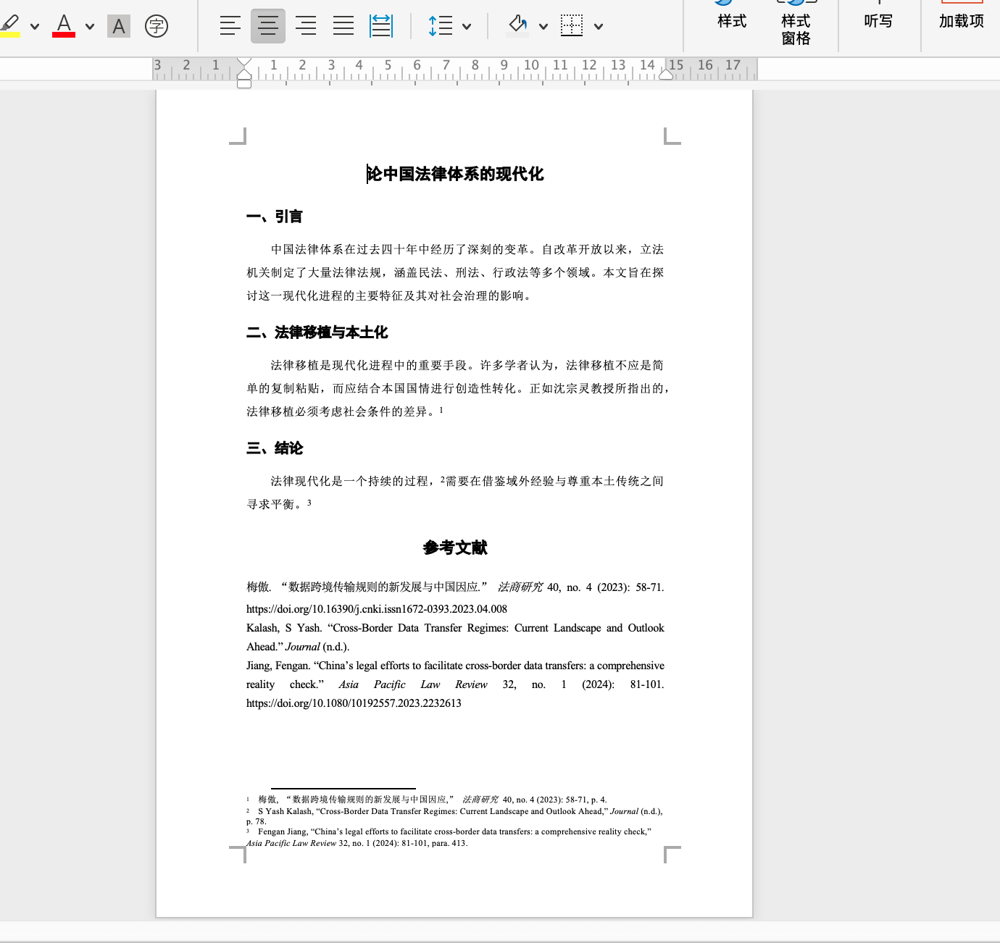
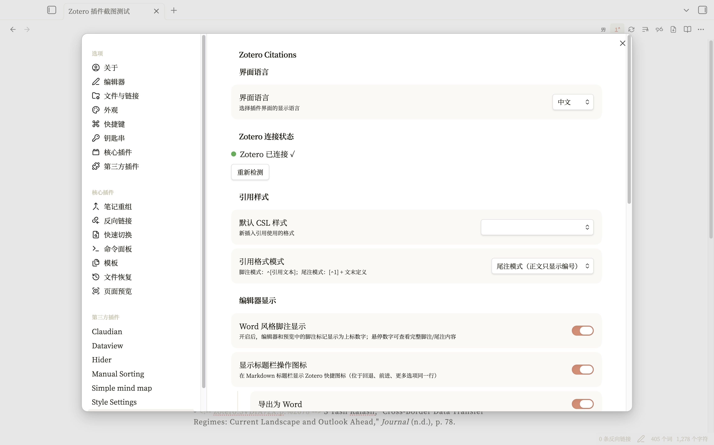
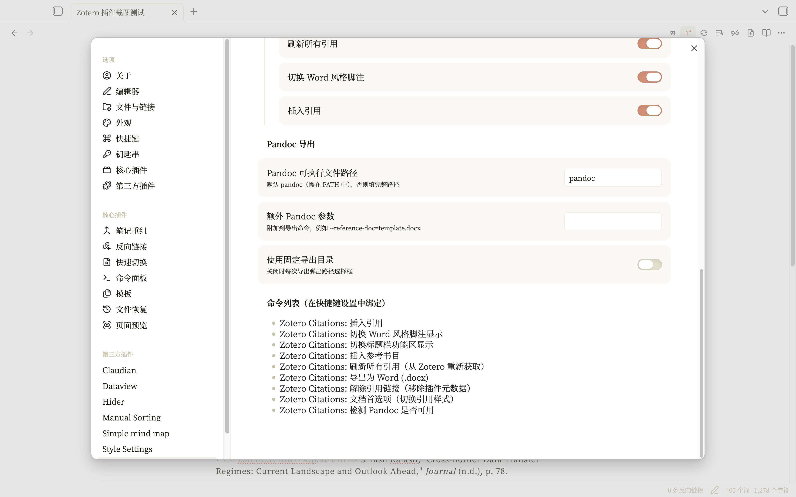

# Zotero Citations

> 在 Obsidian 中管理 Zotero 引用，支持脚注/尾注模式、Word 风格显示，并一键导出为带格式脚注的 Word 文档。

[English](./README_EN.md)

---

## 功能亮点

- **插入引用** — 调用 Zotero 原生引文选择器或插件内搜索面板，支持页码/段落定位符
- **脚注 & 尾注** — 自由切换脚注模式（`^[引用文本]`）和尾注模式（`[^1]` + 文末定义）
- **Word 风格显示** — 编辑器中脚注标记以上标数字呈现，悬停可查看完整引用并编辑定位符
- **文档首选项** — 动态读取 Zotero 中已安装的 CSL 样式，一键切换引用格式与引用模式
- **参考书目** — 自动汇总当前文档所有引用，生成格式化参考文献列表
- **导出为 Word** — 通过 Pandoc 将 Markdown 转换为 `.docx`，完整保留脚注/尾注结构
- **中英双语界面** — 设置中一键切换

---

## 前置要求

| 组件 | 说明 |
|------|------|
| Obsidian 桌面版 1.5.7+ | 插件仅支持桌面端（`isDesktopOnly: true`） |
| [Zotero](https://www.zotero.org/) | 文献管理器，需保持运行 |
| [Better BibTeX](https://github.com/retorquere/zotero-better-bibtex/releases) | Zotero 插件，提供 API 通信 |
| [Pandoc](https://pandoc.org/installing.html)（可选） | 仅导出 Word 时需要 |

---

## 安装

1. 从 GitHub Releases 页面下载以下文件：
   - `main.js` — 插件主程序
   - `manifest.json` — 插件清单
   - `styles.css` — 插件样式
2. 将以上文件放入 vault 的 `.obsidian/plugins/zotero-citations/` 目录（如目录不存在则手动创建）
3. 在 Obsidian 设置 → 第三方插件中启用 **Zotero Citations**
4. 确保 Zotero 已打开且 Better BibTeX 已安装
5. （如需导出 Word）安装 Pandoc 并确保其在系统 PATH 中

---

## 兼容性说明

当前版本主要在 **macOS** 环境下开发与调试。Linux 与 Windows 平台目前尚未充分测试，因此界面显示、窗口聚焦、原生弹窗、导出链路等行为可能存在差异，暂时不能保证完全兼容。

---

## 披露说明

- **网络访问**：插件会通过 `127.0.0.1` 本地回环地址与 Zotero / Better BibTeX 通信，不会连接插件自建服务器。
- **外部文件与可执行程序访问**：插件会读取本机 Zotero 样式目录；在部分回退场景下可能复制并读取本机 Zotero 数据库到系统临时目录；导出 Word 时会调用本地 `pandoc`；数据库回退解析时可能调用本地 `sqlite3`；在 macOS 上，为了从 Zotero 选择器返回 Obsidian，插件可能调用系统 `osascript`。
- **本地数据存储**：插件会在 Obsidian 的插件数据中保存设置项和引用缓存。
- **账户 / 付费 / 广告 / 遥测**：插件不要求登录账户，不含广告，不含内购，也不主动收集遥测数据。
- **源码状态**：插件源码已公开在 GitHub 仓库中，并以 MIT 许可证发布：<https://github.com/WesternGua/obsidian-zotero-citations>

---

## 快速上手

### 1. 插入引用

在命令面板中搜索“插入引用”，或点击标题栏中的插入引用图标。

插件会优先调用 Zotero 原生引文选择器——在弹出窗口中搜索并选择条目，可填写页码等定位符，点击右上角 ✔ 确认插入。

引用插入后以脚注或尾注形式存在（取决于当前引用格式模式设置）。

> **注意**：
> - 插件会在脚注正文开头写入 `<!-- zotero:ITEMKEY:locator -->` 形式的隐藏元数据，请勿手动删除，否则插件无法识别该引用。
> - 定稿后如需移除插件元数据，可执行“解除引用链接”（不可逆），插件会删除隐藏元数据并保留可见引用文本。

### 2. 悬停编辑定位符

开启 Word 风格脚注显示后，鼠标悬停上标数字即可查看完整引用内容，并直接修改页码/段落定位符：

### 3. 切换引用样式

执行“文档首选项”打开文档首选项窗口。插件会动态读取 Zotero 中已安装的所有 CSL 样式，以可搜索列表形式展示；选择所需样式后，可同时切换脚注/尾注模式，并一键应用到当前文档的所有引用：

### 4. 插入参考书目

执行“插入参考书目”，插件会在光标位置生成当前文档所有引用的参考文献列表。参考书目在导出 Word 时也会保留。

### 5. 导出为 Word

1. 在命令面板中执行“检测 Pandoc 是否可用”，确认 Pandoc 正常工作
2. 执行“导出为 Word (.docx)”

导出的 Word 文档包含正确格式的脚注，正文为宋体小四、1.5 倍行距、两端对齐、首行缩进两字符，标题为黑体。

---

## 设置

### 主要设置项

| 设置 | 说明 |
|------|------|
| 界面语言 | 中文 / English |
| 默认 CSL 样式 | 新插入引用使用的格式 |
| 引用格式模式 | 脚注 / 尾注 |
| Word 风格脚注显示 | 上标数字 + 悬停预览 |
| 标题栏按钮 | 主开关 + 6 个子开关（插入引用、切换 Word 风格脚注显示、刷新所有引用、修改引用格式、解除引用链接、导出为 Word），可在设置中分别控制每个按钮的显隐 |
| Pandoc 路径 | 默认 `pandoc`，可填完整路径 |
| 额外 Pandoc 参数 | 如 `--reference-doc=template.docx` |
| 固定导出目录 | 不设则每次弹出选择框 |
| 默认导出目录 | 仅在开启固定导出目录时显示；留空则使用当前文档所在目录 |

---

## 命令列表

以下为插件提供的命令；在命令面板中可直接按命令名称搜索：

| 命令 | 说明 |
|------|------|
| 插入引用 | 打开 Zotero 引文选择器 |
| 插入参考书目 | 在光标处生成参考文献列表 |
| 刷新所有引用 | 从 Zotero 重新拉取并更新 |
| 文档首选项 | 切换 CSL 样式和引用模式 |
| 导出为 Word (.docx) | Pandoc 转换为 Word |
| 解除引用链接 | 移除插件元数据（不可逆） |
| 切换 Word 风格脚注显示 | 开/关上标数字显示 |
| 切换标题栏功能区显示 | 显示/隐藏标题栏图标 |
| 检测 Pandoc 是否可用 | 验证 Pandoc 安装 |

---

## 许可证

MIT
