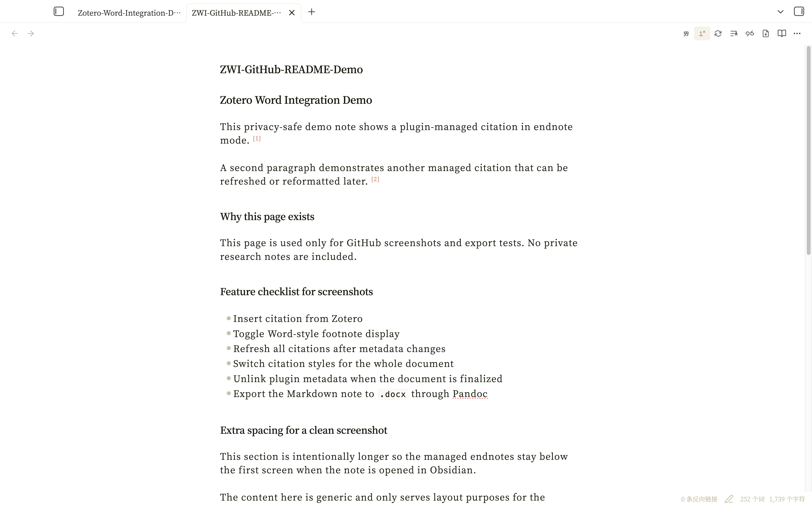
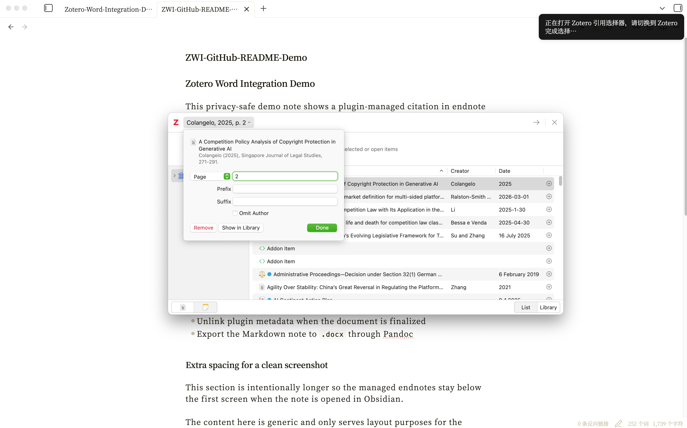
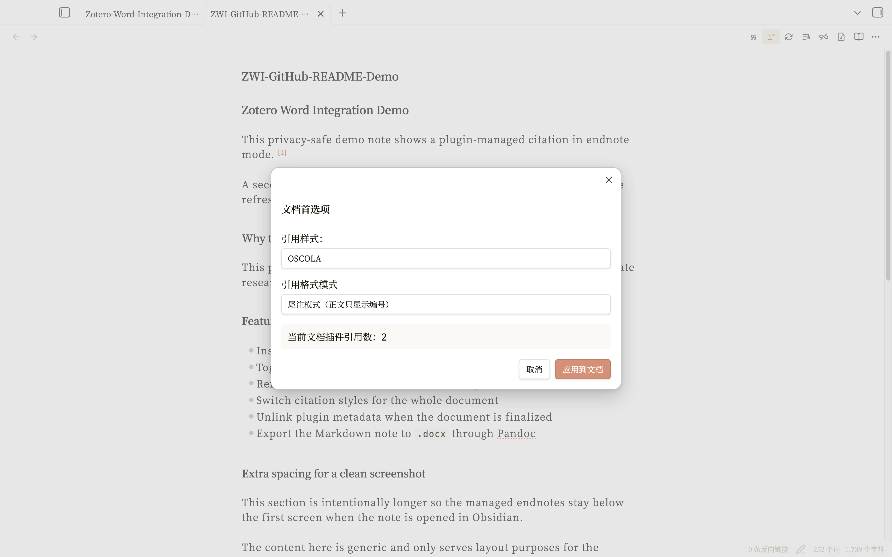
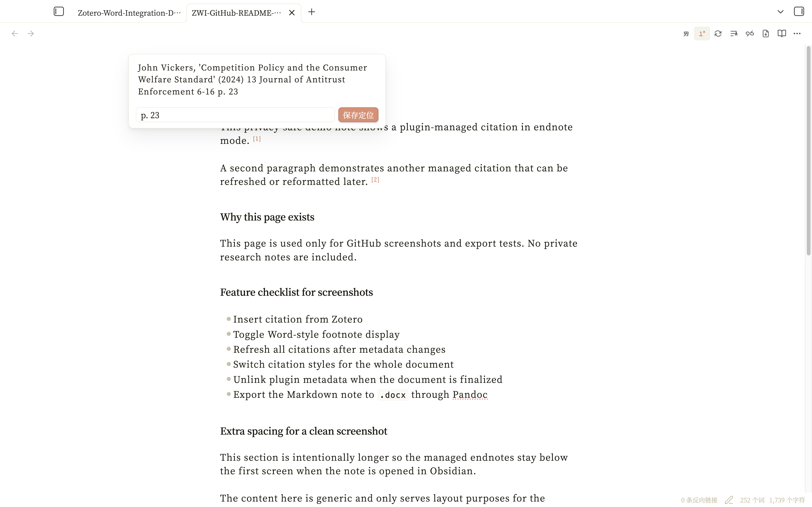
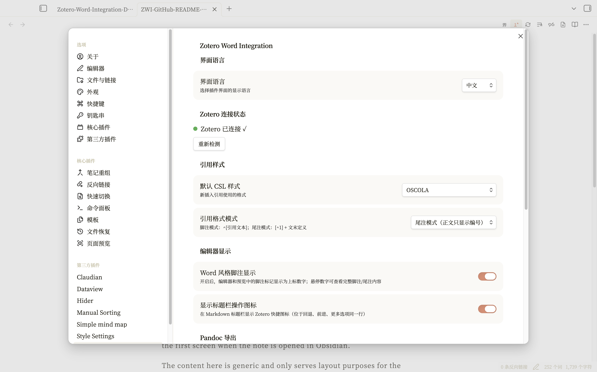
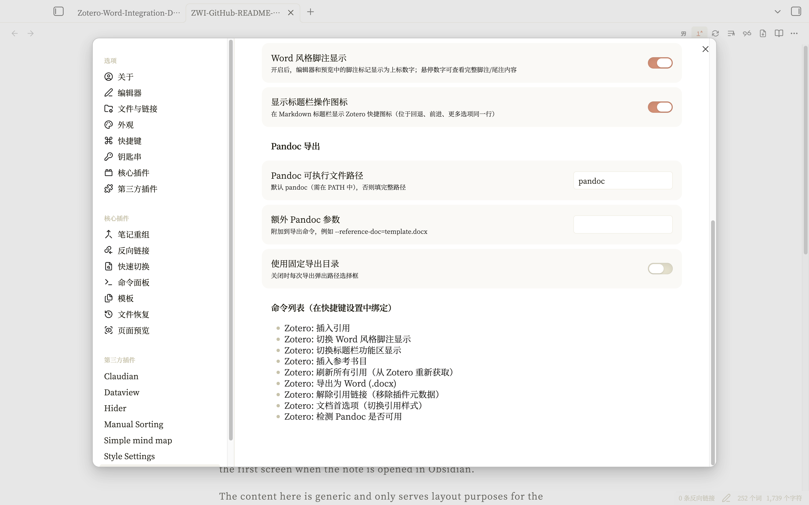
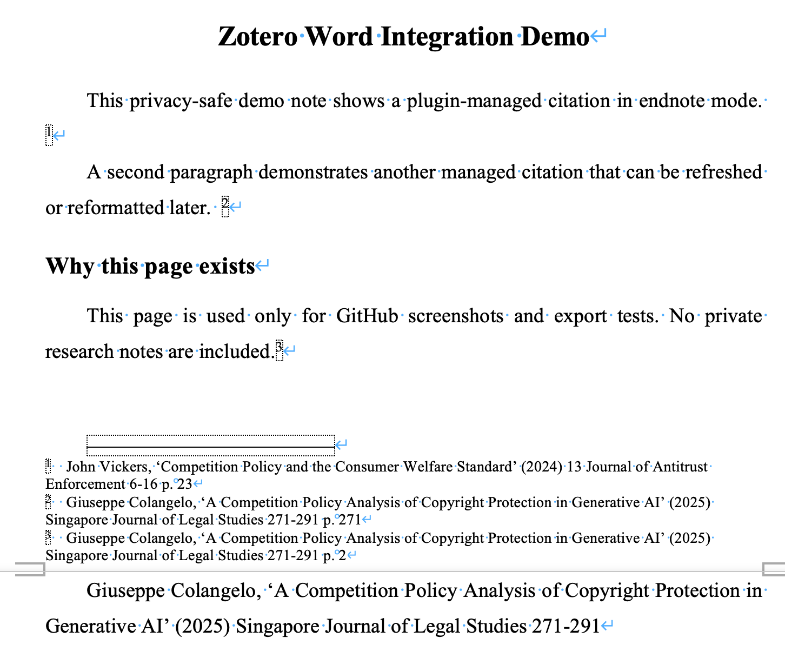

# Zotero Footnotes

一个面向 Obsidian 桌面端的 Zotero 引用管理插件：支持插入引用、切换 Word 风格脚注显示、刷新所有引用、批量修改引用格式、解除引用链接，并通过 Pandoc 导出为 Word（`.docx`）。

> English version is included below in the same file.

## 功能预览 / Screenshots

### 1. 切换 Word 风格脚注显示 / Toggle Word-style footnote display

> 在 Obsidian 编辑器中以 Word 风格上标显示脚注编号。  
> Word-style superscript footnote markers rendered directly inside the Obsidian editor.

### 2. 插入引用 / Insert citations with Zotero's native picker

> 点击功能区的“插入引用”后，插件会优先调用 Zotero 原生引文选择器；支持输入页码、段落等 locator。若原生选择器不可用，插件会回退到插件内搜索面板。  
> After you click “Insert citation”, the plugin first calls Zotero's native citation picker; page, paragraph, and similar locators are supported. If the native picker is unavailable, the plugin falls back to the in-plugin search modal.

### 3. 刷新所有引用 / Refresh all citations

> 一键从 Zotero 重新拉取条目信息，并同步更新当前文档中的脚注、尾注和参考书目。  
> Re-fetch citation data from Zotero with one click and update footnotes, endnotes, and the managed bibliography in the current document.

### 4. 文档级引用首选项 / Document-wide citation preferences

> 可以对当前文档统一修改引用样式和引用模式；“尾注模式（正文只显示编号）”和“脚注模式（^[引用文本]）”均可直接切换。  
> Update citation style and citation mode for the whole document at once; both “endnote mode (number only in the main text)” and “footnote mode (^[citation text])” are available.

### 5. 悬停查看脚注并快速改页码 / Hover preview and quick locator editing

> 悬停脚注编号即可查看完整内容，并可直接修改 locator。  
> Hover a footnote marker to preview the full note and edit its locator in place.

### 6. 插件设置：连接、样式与显示 / Settings: connection, styles, and display

> 设置页可检查 Zotero 连接状态，并配置语言、默认样式、引用模式与显示选项。  
> The settings tab exposes connection status, interface language, default style, citation mode, and display options.

### 7. 插件设置：Pandoc 导出 / Settings: Pandoc export

> 可配置 Pandoc 路径、额外参数和固定导出目录。  
> Configure the Pandoc executable, extra flags, and a fixed export directory.

### 8. 导出的 Word 脚注效果 / Exported Word document with footnotes

> 导出的 `.docx` 文档会保留已插入的脚注编号与脚注正文，便于直接进入 Word 继续校对和交付。  
> The exported `.docx` preserves inserted footnote markers and note text, so you can continue proofreading and delivery work directly in Word.

---

## 中文说明

### 插件定位

`Zotero Footnotes` 是一个桌面端 Obsidian 插件，目标是把 **Zotero 引用工作流**、**Obsidian 写作工作流** 和 **Word 导出工作流** 串起来：

- 在 Obsidian 里插入和维护 Zotero 引用
- 让脚注/尾注在编辑器中更接近 Word 的阅读体验
- 在整篇文档层面切换引用样式和引用模式
- 在完成写作后导出为 `.docx`

### 主要特性

- 插入/编辑引用
- 支持脚注模式与尾注模式
- 支持 Word 风格脚注显示
- 刷新所有引用并同步参考书目
- 文档级批量切换引用样式
- 解除插件元数据链接，保留可见文本
- Pandoc 导出 Word（`.docx`）
- 中英双语界面
- 标题栏快捷操作按钮

### 支持的引用样式

插件内置以下 CSL 风格选项：

- Chicago 17th（注释-书目）
- Chicago 17th（作者-出版年）
- APA 7th Edition
- MLA 9th Edition
- Vancouver
- GB/T 7714-2015（顺序编码）
- GB/T 7714-2015（著者-出版年）
- OSCOLA
- Harvard Cite Them Right
- IEEE

### 安装前置

在使用本插件前，请先准备以下环境：

1. **Obsidian（桌面版）**  
   本插件在 `manifest.json` 中被标记为 `isDesktopOnly: true`，因此仅面向桌面端使用。

2. **Zotero**  
   官方安装说明：<https://www.zotero.org/support/installation>

3. **Better BibTeX for Zotero**  
   官方安装说明：<https://retorque.re/zotero-better-bibtex/installation/>  
   本插件依赖 Better BibTeX 提供的：
   - `better-bibtex/cayw`（调用 Zotero 原生引用选择器）
   - `better-bibtex/json-rpc`（搜索、导出条目、刷新引用）

4. **Pandoc**（用于导出 Word）  
   官方安装说明：<https://pandoc.org/installing.html>

> 建议在安装完成后先打开 Zotero，再回到 Obsidian 使用本插件。

### 在 Obsidian 中安装本插件

#### 方法一：手动安装

1. 打开你的 Obsidian Vault。
2. 进入插件目录：
   - macOS / Linux: `.obsidian/plugins/zotero-footnotes/`
   - Windows: `.obsidian\plugins\zotero-footnotes\`
3. 将本仓库中的以下文件复制进去：
   - `main.js`
   - `manifest.json`
4. 重新加载 Obsidian。
5. 在 **社区插件** 中启用 `Zotero Footnotes`。

#### 方法二：直接使用本仓库作为发布源

如果你打算自己发 GitHub Release，建议保留本仓库里的：

- `main.js`
- `manifest.json`
- `versions.json`
- `README.md`
- `CHANGELOG.md`
- `assets/screenshots/`

### 配置方式

进入 **Settings → Community plugins → Zotero Footnotes** 后，可以配置：

#### 1. 界面语言
- 中文 / English

#### 2. Zotero 连接状态
- 插件会检测 `127.0.0.1:23119` 上的 Zotero/Better BibTeX 连接情况
- 可点击“重新检测”确认状态

#### 3. 默认引用样式
- 新插入的引用默认使用这里选定的 CSL 样式

#### 4. 引用格式模式
- **脚注模式**：写入 `^[引用文本]`
- **尾注模式**：正文写入 `[^1]`，文末写入对应定义

#### 5. Word 风格脚注显示
- 打开后，编辑器和预览中的脚注/尾注标记会显示成更接近 Word 的上标数字效果
- 悬停数字可查看完整脚注内容
- 还可以直接修改 locator（如页码、段落号）

#### 6. 标题栏操作图标
- 开启后，Markdown 标题栏会显示插件快捷按钮：
  - 插入引用
  - 切换 Word 风格脚注显示
  - 刷新所有引用
  - 修改引用格式
  - 解除引用链接
  - 导出为 Word

#### 7. Pandoc 导出
- **Pandoc 可执行文件路径**：默认填写 `pandoc`
- **额外 Pandoc 参数**：例如 `--reference-doc=template.docx`
- **使用固定导出目录**：开启后可指定默认输出目录

> 如果你的 Pandoc 不在系统 PATH 中，可以填写完整路径，例如：`/opt/homebrew/bin/pandoc`。

### 详细功能讲解

#### 1. 插入引用

这是插件的核心入口。

你可以通过以下方式触发：

- 命令面板：`Zotero: 插入引用`
- 标题栏按钮：插入引用图标

工作流程如下：

1. 插件优先调用 Better BibTeX 的 **CAYW（Cite-As-You-Write）接口**，尝试打开 Zotero 原生引文选择器。
2. 如果原生选择器不可用，插件会自动回退到 **Obsidian 内置搜索面板**。
3. 你可以按标题、作者、年份搜索条目。
4. 你可以输入页码/定位符（locator），例如 `23`、`23-25`、`para. 12` 等。
5. 插件会把可见引用文本插入当前文档，同时写入一段隐藏元数据，形式类似：
   - `<!-- zotero:ITEMKEY:locator -->`

这段元数据是后续“刷新所有引用”“修改引用格式”“解除引用链接”的基础。

#### 2. 切换 Word 风格脚注显示

这个功能不会改变你的文档逻辑结构，而是**改变编辑器与预览中的显示方式**。

开启后：

- 脚注/尾注标记会显示为更接近 Word 的上标数字
- 悬停编号可以查看完整脚注或尾注内容
- 可以在悬浮面板里直接修改 locator，并即时回写到 Markdown

关闭后：

- 文档仍然保留插件管理的引用
- 只是显示退回普通 Markdown 的可见形式

因此，它更像是一个 **阅读与校对增强层**，而不是一个 destructive 操作。

#### 3. 刷新所有引用

当 Zotero 条目元数据发生变化后，这个功能可以把当前文档重新同步一遍。

它会做几件事：

1. 重新从 Zotero / Better BibTeX 获取条目数据
2. 根据当前样式，重写所有插件管理的引用文本
3. 如果文档中已经存在插件管理的参考书目块，则一起更新参考书目
4. 自动清理失去正文引用的“孤立尾注”
5. 如果文档已经没有插件管理引用，也会一并移除由插件生成的参考书目块

适合在这些场景使用：

- 你刚刚修改了 Zotero 条目标题、作者、年份、页码等信息
- 你切换了样式，想统一刷新全文
- 你怀疑文档里的旧引用文本没有同步到最新条目数据

#### 4. 修改引用格式

这个功能对应“文档首选项（Document preferences）”。

它不是只改“默认设置”，而是可以**把当前文档已经插入的插件管理引用整体重排**。

你可以同时修改两类东西：

- **引用样式**：如 OSCOLA、APA、Chicago、GB/T 7714 等
- **引用模式**：脚注模式 / 尾注模式

执行时，插件会：

1. 统计当前文档中的插件管理引用数量
2. 尝试获取这些引用对应的 Zotero 条目
3. 按所选样式重新格式化全文引用
4. 按所选模式在 `^[...]` 与 `[^1] + 定义` 之间转换
5. 若文档中存在参考书目，则一起更新

这意味着你可以先用一种风格写作，最后再统一改成投稿要求的风格。

#### 5. 解除引用链接

这个功能用于“定稿”或“导出前清理”。

它会：

- **删除插件写入的隐藏 Zotero 元数据注释**
- **保留屏幕上可见的引用文本**

也就是说，执行后：

- 文档看起来还是原来的引用样子
- 但这些引用将不再被插件识别为“可刷新、可重排、可追踪”的托管引用

适合在这些场景使用：

- 你要把 Markdown 发给不使用本插件的人
- 你不希望继续携带 Zotero 元数据
- 你已经完成所有排版，不再需要刷新引用

#### 6. 插入参考书目

虽然你这次特别点名的是脚注、刷新、改格式和导出，但这个功能本身也很重要。

插件可以在文档中插入一个“托管参考书目块”，并用以下标记包裹：

- `<!-- zotero-bibliography-start -->`
- `<!-- zotero-bibliography-end -->`

后续执行“刷新所有引用”或“修改引用格式”时，参考书目也会跟着一起更新。

#### 7. 导出为 Word（`.docx`）

这是把 Obsidian 写作结果交付到 Word 的最后一步。

你可以通过：

- 命令面板：`Zotero: 导出为 Word (.docx)`
- 标题栏按钮：导出图标

工作方式如下：

1. 插件读取当前打开的 Markdown 文件
2. 调用本机 Pandoc 执行导出
3. 输出同名 `.docx` 文件
4. 如果你没有开启固定导出目录，插件会先询问输出路径
5. 如果你配置了额外 Pandoc 参数，会一并附加到导出命令中

根据源码，插件在导出时还会生成一个内置 reference doc，用来给 Word 文档提供一套更适合中英文混排法学写作的默认样式（如正文、标题、脚注文本等）。

#### 8. 检测 Pandoc 是否可用

插件还提供单独的命令：

- `Zotero: 检测 Pandoc 是否可用`

如果你第一次配置导出功能，建议先运行一次，确认 `pandoc` 路径设置正确。

### 命令总览

插件当前提供这些命令：

- Zotero: 插入引用
- Zotero: 切换 Word 风格脚注显示
- Zotero: 切换标题栏功能区显示
- Zotero: 插入参考书目
- Zotero: 刷新所有引用（从 Zotero 重新获取）
- Zotero: 导出为 Word (.docx)
- Zotero: 解除引用链接（移除插件元数据）
- Zotero: 文档首选项（切换引用样式）
- Zotero: 检测 Pandoc 是否可用

### 仓库内容说明

本资料包中包含：

- `main.js`：插件主文件
- `manifest.json`：Obsidian 插件清单
- `versions.json`：版本兼容声明
- `README.md`：中英双语说明
- `CHANGELOG.md`：更新记录
- `CONTRIBUTORS.md`：贡献者信息
- `THIRD_PARTY_NOTICES.md`：第三方依赖说明
- `assets/screenshots/`：README 使用的真实截图

本资料包**刻意不包含**以下内容：

- `data.json`：里面通常包含本地设置和缓存过的 Zotero 条目，不适合直接发布到 GitHub
- `main.js.bak.*`：本地备份文件，不属于发布产物

### 已知前提与限制

- 仅支持桌面端 Obsidian
- 使用插入/刷新功能时，建议保持 Zotero 运行中
- Better BibTeX 是必需依赖
- Word 导出依赖 Pandoc

### 贡献者

- **WesternGua**
- **GPT-5.4**

---

# English

## What this plugin does

`Zotero Footnotes` is an Obsidian desktop plugin that connects three workflows in one place:

- Zotero citation management
- Obsidian writing and editing
- Word export through Pandoc

It supports inserting citations, showing Word-style footnote markers, refreshing all managed citations, switching citation styles for an entire document, unlinking plugin metadata, and exporting Markdown to `.docx`.

## Key features

- Insert or edit citations
- Footnote mode and endnote mode
- Word-style footnote display inside the editor and preview
- Refresh all citations from Zotero
- Document-wide citation style conversion
- Unlink plugin metadata while keeping visible citation text
- Insert and maintain a bibliography block
- Export to Word with Pandoc
- Bilingual UI (Chinese / English)
- Title-bar quick actions

## Supported citation styles

The plugin exposes the following CSL choices:

- Chicago 17th (Notes-Bibliography)
- Chicago 17th (Author-Date)
- APA 7th Edition
- MLA 9th Edition
- Vancouver
- GB/T 7714-2015 (Numeric)
- GB/T 7714-2015 (Author-Date)
- OSCOLA
- Harvard Cite Them Right
- IEEE

## Prerequisites

Before using the plugin, install:

1. **Obsidian Desktop**  
   The plugin is marked as `isDesktopOnly: true` in `manifest.json`.

2. **Zotero**  
   Official install guide: <https://www.zotero.org/support/installation>

3. **Better BibTeX for Zotero**  
   Official install guide: <https://retorque.re/zotero-better-bibtex/installation/>  
   The plugin depends on Better BibTeX for:
   - `better-bibtex/cayw` (native Zotero citation picker)
   - `better-bibtex/json-rpc` (searching items, exporting item data, refreshing citations)

4. **Pandoc**  
   Official install guide: <https://pandoc.org/installing.html>

> In practice, it is best to launch Zotero first and then use the plugin inside Obsidian.

## Installing the plugin in Obsidian

### Manual install

1. Open your Obsidian vault.
2. Go to:
   - macOS / Linux: `.obsidian/plugins/zotero-footnotes/`
   - Windows: `.obsidian\\plugins\\zotero-footnotes\\`
3. Copy these files from this repository into that folder:
   - `main.js`
   - `manifest.json`
4. Reload Obsidian.
5. Enable `Zotero Footnotes` in **Community plugins**.

### Suggested repository contents for GitHub releases

If you want to publish releases from GitHub, keep these files in the repo:

- `main.js`
- `manifest.json`
- `versions.json`
- `README.md`
- `CHANGELOG.md`
- `assets/screenshots/`

## Configuration

Open **Settings → Community plugins → Zotero Footnotes**.

You can configure:

### 1. Interface language
- Chinese / English

### 2. Zotero connection status
- The plugin checks the Zotero / Better BibTeX endpoint on `127.0.0.1:23119`
- Use the re-check button to confirm connectivity

### 3. Default citation style
- Newly inserted citations use the selected CSL style

### 4. Citation mode
- **Footnote mode**: stores citations as `^[citation text]`
- **Endnote mode**: stores number markers in the main text and writes `[^1]` definitions below

### 5. Word-style footnote display
- Shows footnote or endnote markers as superscript numbers in the editor and preview
- Hovering a marker reveals the full note text
- The hover popover also lets you edit the locator directly

### 6. Title-bar action icons
- Adds quick-access buttons for:
  - Insert citation
  - Toggle Word-style footnote display
  - Refresh all citations
  - Change citation style
  - Unlink citations
  - Export to Word

### 7. Pandoc export options
- **Pandoc executable path**: defaults to `pandoc`
- **Extra Pandoc flags**: e.g. `--reference-doc=template.docx`
- **Fixed export directory**: optional default output folder

> If Pandoc is not available in your PATH, set the full executable path manually, for example `/opt/homebrew/bin/pandoc`.

## Detailed feature walkthrough

### 1. Insert citation

Trigger it from:

- the command palette (`Zotero: Insert citation`)
- the title-bar citation button

How it works:

1. The plugin first tries Better BibTeX's **CAYW** endpoint to open Zotero's native citation picker.
2. If that fails, it automatically falls back to an **in-plugin search modal** inside Obsidian.
3. You can search by title, author, or year.
4. You can provide a page or locator.
5. The visible citation text is inserted into the note together with hidden metadata such as `<!-- zotero:ITEMKEY:locator -->`.

That hidden metadata is what makes later refreshes, style changes, and unlinking possible.

### 2. Toggle Word-style footnote display

This feature changes how citations are displayed, not how they are stored.

When enabled:

- footnote and endnote markers are shown as Word-like superscript numbers
- hovering a marker reveals the full note text
- the hover panel allows quick locator editing

When disabled:

- the citations remain plugin-managed
- only the display falls back to ordinary Markdown presentation

So this is a reading and proofreading enhancement, not a destructive conversion.

### 3. Refresh all citations

Use this when Zotero metadata changes and you want the current document to catch up.

The plugin will:

1. fetch item data again from Zotero / Better BibTeX
2. rewrite all plugin-managed citations using the current style
3. update the managed bibliography block if one exists
4. remove orphan endnotes that are no longer referenced in the body text
5. remove the managed bibliography block if the document no longer contains managed citations

Typical use cases:

- you corrected item metadata in Zotero
- you changed citation style and want a clean full-document refresh
- you want to ensure visible citation text matches the current Zotero data

### 4. Change citation style

This is handled through **Document preferences**.

It does more than changing the default for future inserts: it can reformat the citations that already exist in the current document.

You can change both:

- **citation style** (OSCOLA, APA, Chicago, GB/T 7714, etc.)
- **citation mode** (footnote vs. endnote)

When you apply the change, the plugin:

1. counts all plugin-managed citations in the document
2. resolves the corresponding Zotero items
3. reformats all managed citations using the selected style
4. converts between `^[...]` and `[^1]` + definition mode when needed
5. updates the bibliography block if it already exists

This makes it practical to draft in one style and switch to a submission-ready style later.

### 5. Unlink citations

Use this when you want to finalize the Markdown and remove plugin-specific metadata.

The plugin:

- removes the hidden Zotero metadata comments
- keeps the visible citation text unchanged

After unlinking:

- the document still looks the same to a reader
- but those citations are no longer refreshable or style-switchable by the plugin

Good use cases:

- sharing raw Markdown with people who do not use this plugin
- cleaning plugin metadata out of the file
- freezing the current citation text before final delivery

### 6. Insert bibliography

The plugin can insert a managed bibliography block wrapped by:

- `<!-- zotero-bibliography-start -->`
- `<!-- zotero-bibliography-end -->`

That block is later updated by both **Refresh all citations** and **Document preferences**.

### 7. Export to Word (`.docx`)

Trigger it from:

- the command palette (`Zotero: Export to Word (.docx)`)
- the title-bar export button

Workflow:

1. the plugin reads the currently open Markdown file
2. it calls the local Pandoc executable
3. it exports a `.docx` file with the same base name
4. if a fixed export directory is not enabled, the plugin prompts for the output location
5. any extra Pandoc flags are appended to the export command

Based on the source code, the plugin also generates an internal reference document for export so that the resulting Word file starts with a more Chinese-law-writing-friendly default style set for body text, headings, and footnotes.

### 8. Check whether Pandoc is available

The plugin also exposes a dedicated command:

- `Zotero: Check whether Pandoc is available`

Run this once when you configure export for the first time.

## Command list

The plugin currently provides:

- Zotero: Insert citation
- Zotero: Toggle Word-style footnote display
- Zotero: Toggle title bar actions
- Zotero: Insert bibliography
- Zotero: Refresh all citations (re-fetch from Zotero)
- Zotero: Export to Word (.docx)
- Zotero: Unlink citations (remove plugin metadata)
- Zotero: Document preferences (change citation style)
- Zotero: Check whether Pandoc is available

## Repository contents

This package includes:

- `main.js` — plugin runtime file
- `manifest.json` — Obsidian plugin manifest
- `versions.json` — version compatibility mapping
- `README.md` — bilingual documentation
- `CHANGELOG.md` — release notes
- `CONTRIBUTORS.md` — contributor information
- `THIRD_PARTY_NOTICES.md` — third-party dependency notes
- `assets/screenshots/` — real screenshots used by the README

This package intentionally does **not** include:

- `data.json` — it usually contains local settings and cached Zotero item data
- `main.js.bak.*` — local backup builds, not release artifacts

## Constraints and assumptions

- Desktop only
- Zotero should be running for insert/refresh workflows
- Better BibTeX is required
- Word export requires Pandoc

## Contributors

- **WesternGua** — plugin author
- **GPT-5.4** — packaging, documentation drafting, release-material organization
