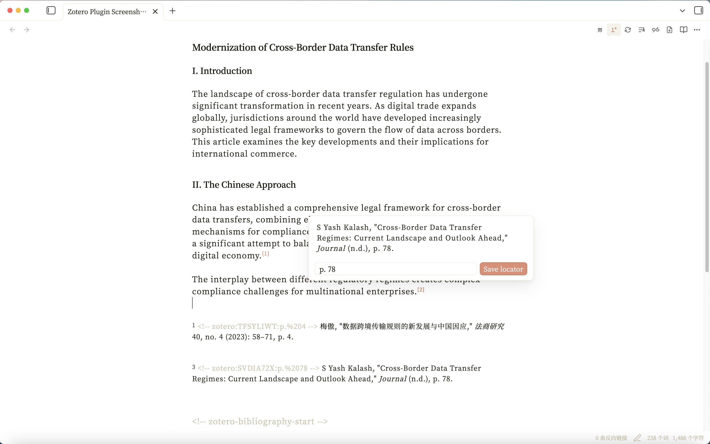
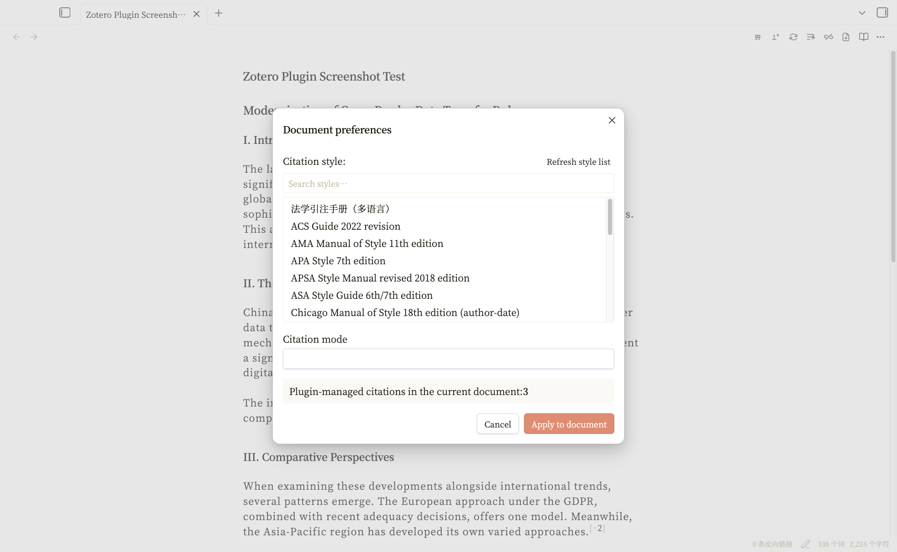
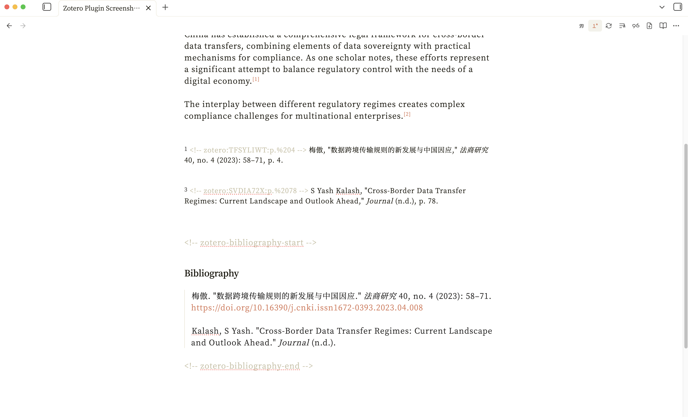
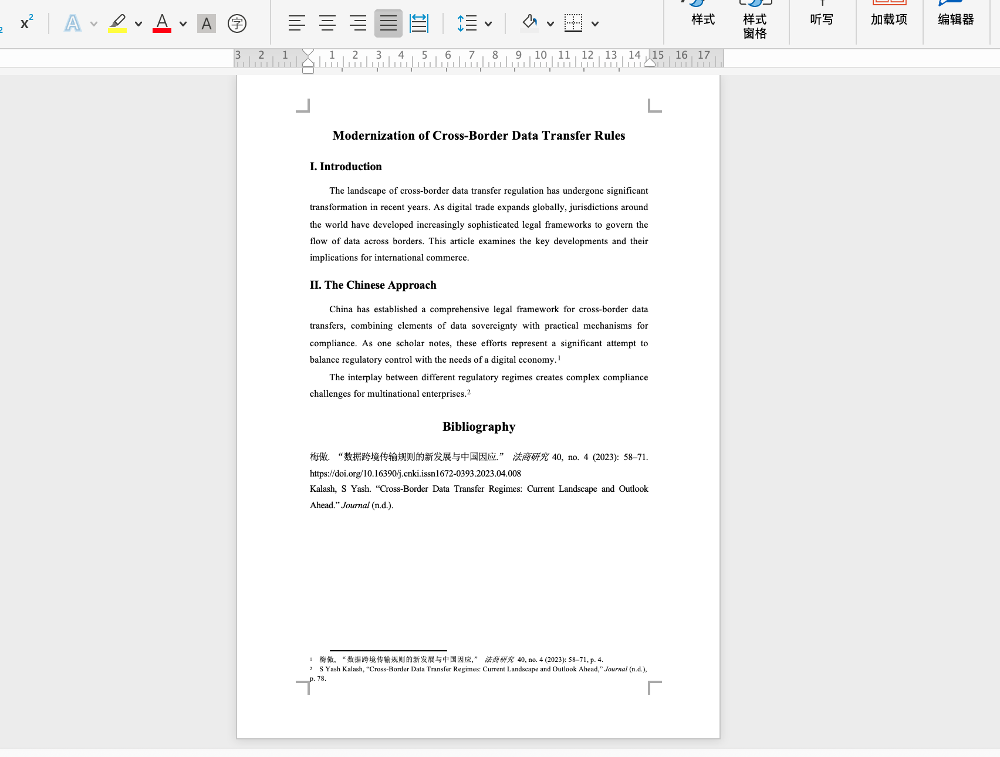
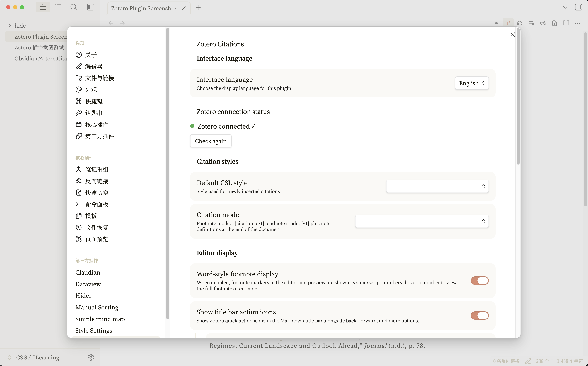
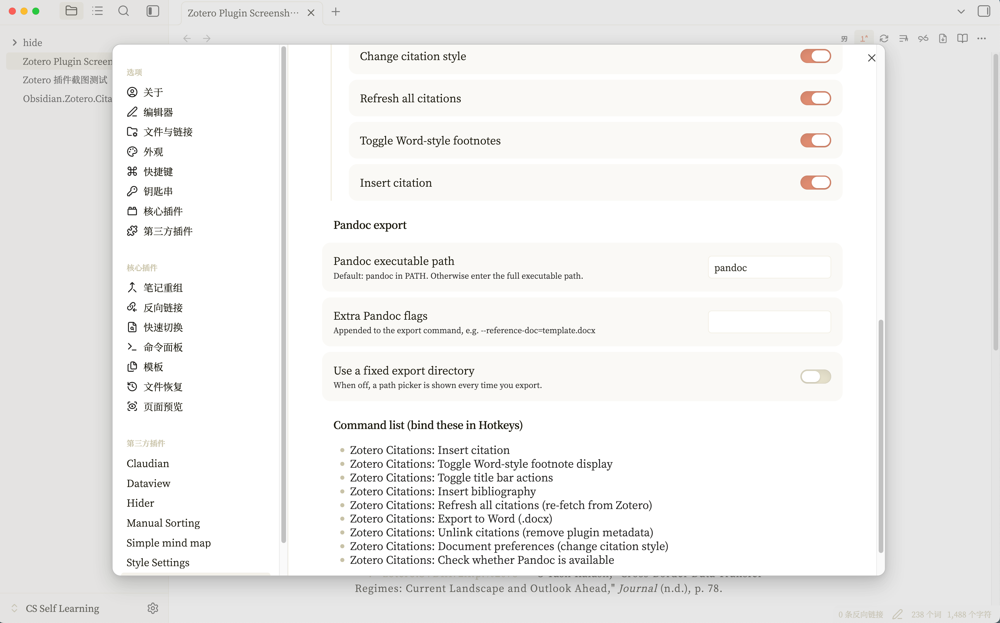

# Zotero Citations

> Manage Zotero citations in Obsidian with footnote/endnote modes, Word-style display, and one-click export to Word with formatted footnotes.

---

## Highlights

- **Insert citations** — Invokes Zotero's native citation picker or an in-plugin search modal, with support for page/paragraph locators
- **Footnote & endnote** — Freely switch between footnote mode (`^[citation text]`) and endnote mode (`[^1]` + endnote definitions)
- **Word-style display** — Footnote markers render as superscript numbers in the editor; hover to preview the full citation and edit locators
- **Document preferences** — Dynamically reads all CSL styles installed in Zotero, with one-click style and mode switching
- **Bibliography** — Auto-generates a formatted reference list from all citations in the current document
- **Export to Word** — Converts Markdown to `.docx` via Pandoc, preserving footnote/endnote structure
- **Bilingual UI** — Switch between Chinese and English in settings

---

## Prerequisites

| Component | Description |
|-----------|-------------|
| Obsidian Desktop 1.5.7+ | Desktop-only plugin (`isDesktopOnly: true`) |
| [Zotero](https://www.zotero.org/) | Reference manager; should be running |
| [Better BibTeX](https://github.com/retorquere/zotero-better-bibtex/releases) | Zotero plugin that provides the API layer |
| [Pandoc](https://pandoc.org/installing.html) (optional) | Required only for Word export |

---

## Installation

1. Download the following files from the GitHub Releases page:
   - `main.js` — plugin runtime
   - `manifest.json` — plugin manifest
2. Place the files into your vault's `.obsidian/plugins/zotero-citations/` directory (create it if it does not exist)
3. Enable **Zotero Citations** in Obsidian Settings → Community plugins
4. Make sure Zotero is running and Better BibTeX is installed
5. (For Word export) Install Pandoc and ensure it is on your system PATH

---

## Development Build

If you are working from the source tree directly:

1. Run `npm install` in the plugin directory
2. Run `npm run check` for TypeScript verification
3. Run `npm run build` to regenerate `main.js`
4. Reload the `zotero-citations` plugin in Obsidian

See [docs/DEVELOPMENT.md](./docs/DEVELOPMENT.md) for the full development and release workflow.

---

## Repository Layout

- `src/` — TypeScript source
- `assets/screenshots/` — README image assets
- `docs/` — development and maintenance docs
- `manifest.json` — Obsidian plugin manifest
- `versions.json` — compatibility map from plugin version to minimum Obsidian version
- `main.js` — build artifact; Obsidian loads this directly when this folder is used as the live plugin directory
- `data.json` — local plugin data and should not be version-controlled

---

## GitHub Repo Notes

If you later split this directory into its own GitHub repository, this layout can stay as-is. A typical setup is:

- commit `src/`, `manifest.json`, `versions.json`, `README*`, and `CHANGELOG.md`
- ignore `node_modules/`, `data.json`, and `.DS_Store`
- validate with GitHub Actions or local `npm run check && npm run build`

---

## Quick Start

### 1. Insert a Citation

Run `Zotero Citations: Insert citation` from the command palette, or click the citation icon in the title bar.

The plugin will first try to open Zotero's native citation picker — search for items, add a page number or other locator, and confirm with the checkmark button.

Inserted citations appear as footnotes or endnotes depending on your current citation mode setting.

> **Note**:
> - The plugin writes hidden metadata (`<!-- zotero:ITEMKEY:locator -->`) at the beginning of each note. Do not remove it manually, or the plugin will not be able to track the citation.
> - When you are ready to finalize, run `Zotero Citations: Unlink citations` (irreversible) to strip the hidden metadata while keeping the visible citation text.

### 2. Hover to Edit Locators

With Word-style footnote display enabled, hover over a superscript number to preview the full citation and edit the page/paragraph locator directly:

### 3. Switch Citation Style

Run `Zotero Citations: Document preferences` to open the preferences panel. The plugin dynamically reads all CSL styles installed in your Zotero and presents them in a searchable list. Pick a style, optionally switch between footnote/endnote mode, and apply the change to all citations in the current document at once:

### 4. Insert a Bibliography

Run `Zotero Citations: Insert bibliography` to generate a formatted reference list at the cursor position. The bibliography is also preserved when exporting to Word.

### 5. Export to Word

1. Run `Zotero Citations: Check whether Pandoc is available` first to confirm Pandoc is working.
2. Run `Zotero Citations: Export to Word (.docx)`.

The exported Word document contains properly formatted footnotes, with body text in SimSun 12pt, 1.5 line spacing, justified alignment, first-line indent, and headings in SimHei.

---

## Settings

### Main Settings

| Setting | Description |
|---------|-------------|
| Interface language | Chinese / English |
| Default CSL style | Format used for newly inserted citations |
| Citation mode | Footnote / Endnote |
| Word-style footnote display | Superscript numbers + hover preview |
| Title bar buttons | Master toggle + 6 individual toggles (Insert citation, Toggle Word-style footnote display, Refresh all citations, Change citation style, Unlink citations, Export to Word), each controllable independently in settings |
| Pandoc path | Defaults to `pandoc`; accepts full paths |
| Extra Pandoc arguments | e.g. `--reference-doc=template.docx` |
| Fixed export directory | If unset, prompts for output location each time |
| Default export directory | Shown only when fixed export directory is enabled; if blank, uses the current note's folder |

---

## Command List

All commands are prefixed with `Zotero Citations:` for easy discovery in the command palette:

| Command | Description |
|---------|-------------|
| Insert citation | Open the Zotero citation picker |
| Insert bibliography | Generate a reference list at the cursor |
| Refresh all citations | Re-fetch item data from Zotero and update |
| Document preferences | Switch CSL style and citation mode |
| Export to Word (.docx) | Convert to Word via Pandoc |
| Unlink citations | Remove plugin metadata (irreversible) |
| Toggle Word-style footnote display | Enable/disable superscript markers |
| Toggle title bar actions | Show/hide the title bar icons |
| Check whether Pandoc is available | Verify Pandoc installation |

---

## License

MIT
